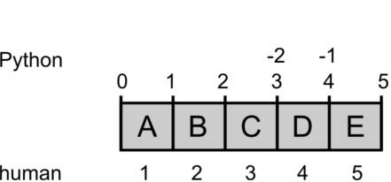

# Indexing

Computers and people count differently.

Computers treat an address in memory as the *starting point* of a body of data. In the same sense, an *index* in Python always refers to such a starting point, something that is *in between* two objects in memory. We humans in contrast always count the objects themselves.

This is why the indices used to slice list are a bit intuitive at first, e.g. in: 

    >>> s = "my fat cat"
    >>> s[3:6]
    'fat'

The above diagram provides a pracitcal model by which you can deduce indices yourself.
